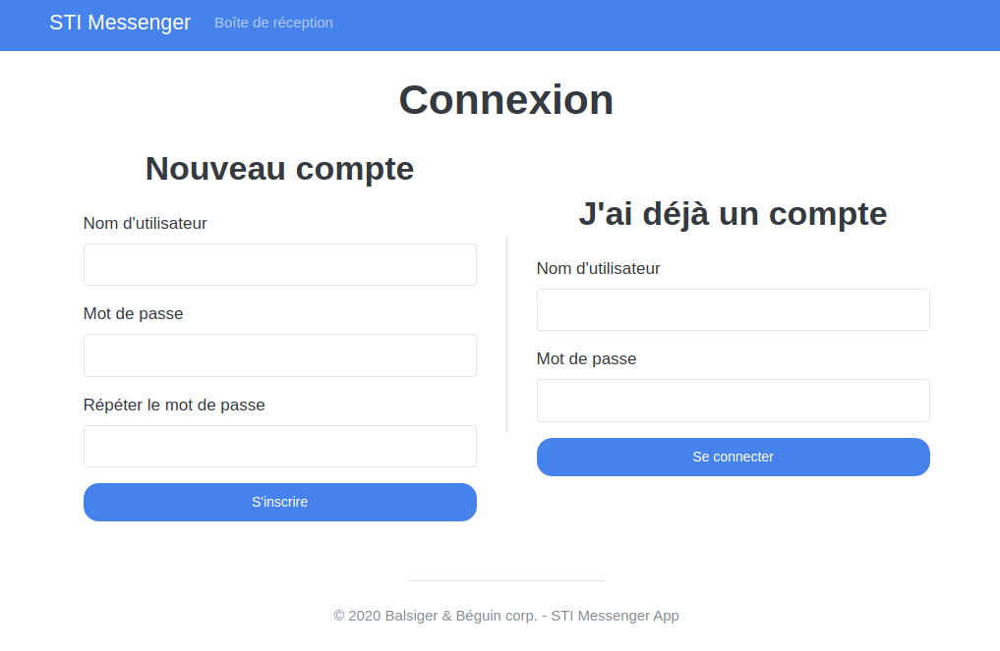
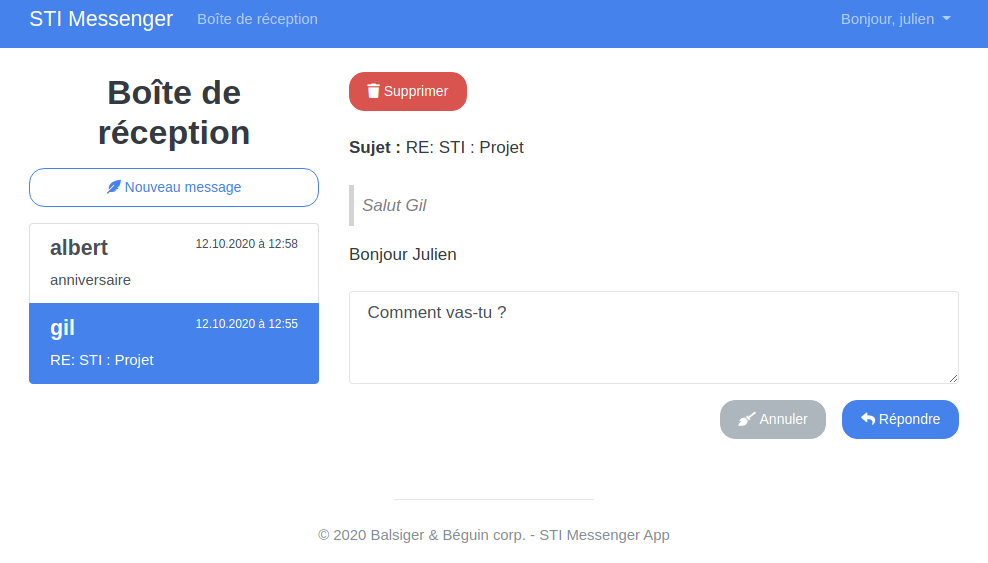
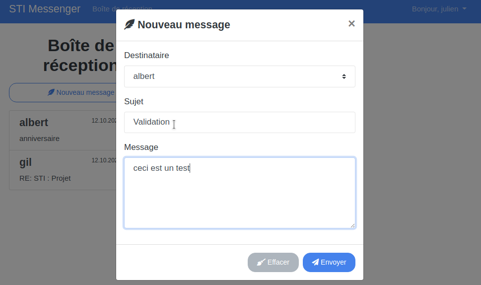
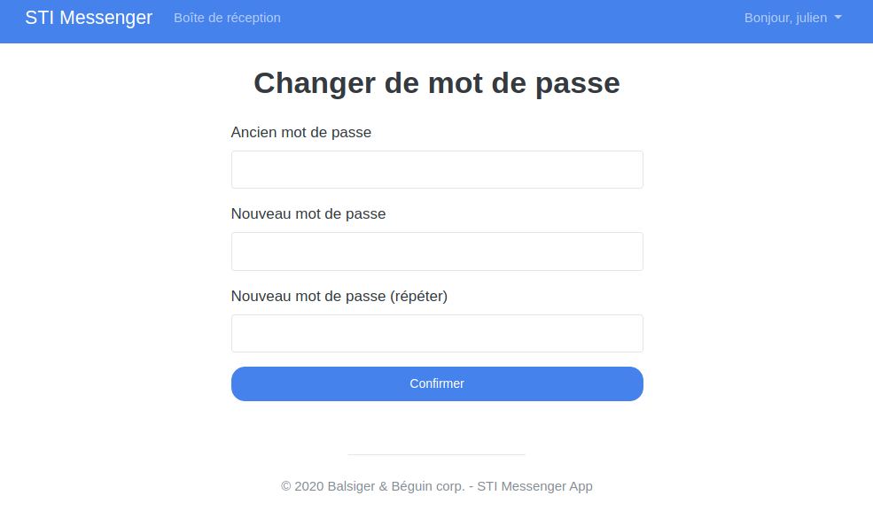
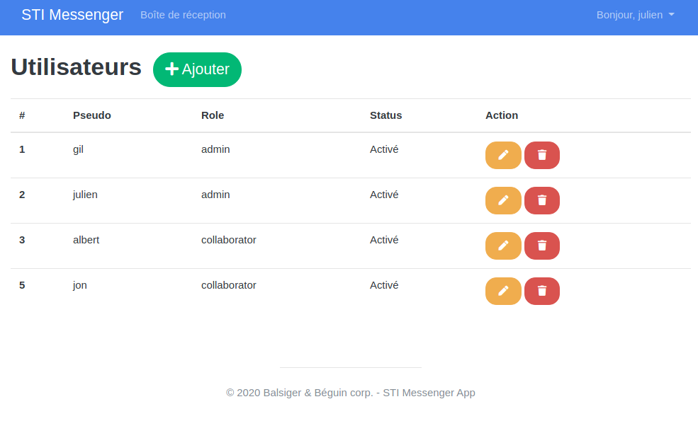
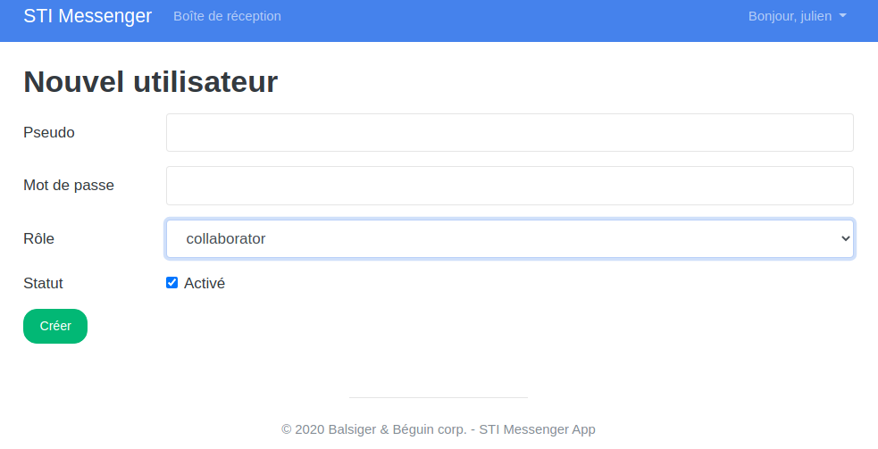

# STI : Projet 1 - Système de messagerie

> Auteurs : Gil Balsiger & Julien Béguin
> Date : 12.10.20


## Installation

```
git clone --depth=1 https://github.com/balsigergil/STI-Messenger.git
cd STI-Messenger/
make init
```

Cette commande permet de construire et lancer les conteneurs ainsi que d'installer les dépendances nécessaires. Lorsque l'initialisation est terminé, vous pouvez accéder à l'application avec l'URL suivant : **http://localhost:8080/**.

### Start/Stop

**Lancer les conteneurs** : `make up` (la commande `make init` est uniquement nécessaire lors de la première utilisation)

**Arrêter les conteneurs** : `make stop`

Besoin d'aide ? : `make help`


## Utilisation

### Inscription/connexion

Cette page permet d'accéder au reste du site. Le formulaire de gauche permet de s'enregistrer alors que le formulaire de droite permet de se connecter :



----

### Boite de réception

Ceci est la page principale du site. Elle permet de recevoir, répondre, supprimer et envoyer des message à d'autres utilisateurs. Le menu de gauche permet de lister un aperçu des messages reçus. En cliquant sur un message, ce dernier est chargé dans la partie de droite. On peut alors voir le contenu du message ainsi que l'historique de la conversation (apparaissant en citation). Le champs textuel en dessous du message permet d'y répondre directement :



---

Création d'un nouveau message :



----

### Profile

La page de profile permet uniquement de changer de mot de passe. Elle est accessible depuis le bouton à droite de la bar de navigation supérieur :



---

### Administration

La page d'administration est uniquement accessible au utilisateur possédant le rôle nécessaire. Elle permet d'ajouter, supprimer et modifier des utilisateurs :



---

Création d'un nouvel utilisateur :

